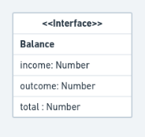

# RocketSeat - GoStack 11
## Project 01 - Personal Budget App - Part 01 - Back-End

This is the first project for the RocketSeat GoStack bootcamp 11th edition and it is an exercise of TypeScript implementation on the ExpressJS microframework and SOLID concepts of object-oriented programming.

### Idea

This application will allow the users to store income and outcome entries for their personal transactions.

### Application's Routes

This application will have the following routes:

- **`GET /transactions`**: This route shall return an array of `transactions` containing all record for the financial movement. It will also return a **`Balance`** object, which is holds the sum of all entries for `income`, `outcome` and `total` (as the resulting balance), each one in a member value.

**Ex**:

```json
{
  "transactions": [
    {
      "id": "uuid",
      "title": "Salário",
      "value": 4000,
      "type": "income"
    },
    {
      "id": "uuid",
      "title": "Freela",
      "value": 2000,
      "type": "income"
    },
    {
      "id": "uuid",
      "title": "Pagamento da fatura",
      "value": 4000,
      "type": "outcome"
    },
    {
      "id": "uuid",
      "title": "Cadeira Gamer",
      "value": 1200,
      "type": "outcome"
    }
  ],
  "balance": {
    "income": 6000,
    "outcome": 5200,
    "total": 800
  }
}
```

- **`POST /transactions`**: In this route, the user will a **`Transaction`** data to be stored. The transaction object and returned as a response when sucessfully created

**Ex**:
```json
{
  "id": "uuid",
  "title": "Salário",
  "value": 3000,
  "type": "income"
}
```

### Route's Diagram


## Entities

This project's structure has its functionality spread along some entities. Up to this moment the entities are:

- **`Transaction`**: The transaction object is represented as a class. The id here is generated by the `uuid` module.


- **`Balance`**: The balance object is represented as an interface and it is the total amount for income, outcome and grand total for the user's balance.



- **`Route`**: The route file contains the middlewares for the endpoints listed above. It imports the `Transactions Repository` and the `Create Transactions Service` for accessing and processing the `Transactions` entity's data.

- **`Transaction Repository`**: This entity is responsible for reaching the data storage for the `Transaction` (so far, a simple array) and manipulate its state.
  So far, the `Transaction Repository` does the following:
  - **Retrieve all `Transactions`**
  - **Calculate and retrieve the `Balance`**
  - **Create a new `Transaction`**

  

- **`Create Transaction Service`**: This object is a class that is responsible for processing the `Transaction`'s data and giving it back to the route that makes use of it.
  So far, the only task it performs is to create a new `Transaction`.


### Data Flow Diagram

The data flow at this moment is minimal, it goes from the user, through the repository and service, then back to the user via the routes.


## Running and Testing

This application can be executed with the command `yarn dev:server` (if you use yarn) or `npm run dev:server` and can be tested with via Jest.js through the commands `yarn test` or `npm run` test. The server will run on the port 3333 by default. (You can alter it in the src/server.js file)
